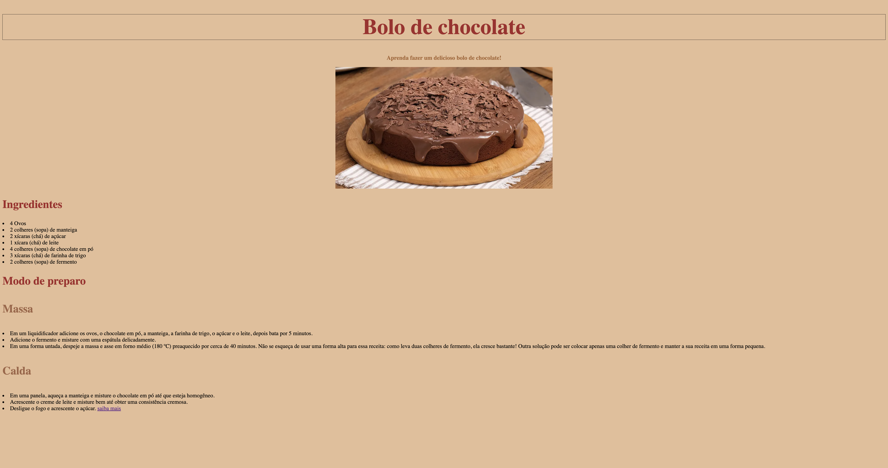

# receita-2024

---
## Sobre

Site do Tipo receita, Foi o primeiro projeto de pratica com HTML e CSS, no intuito de aprender a base de como fuciona essa tecnologia no curso de Desenvolvimento de Sistemas no [SENAI JANDIRA](https://sp.senai.br/unidade/jandira/).

## Tecnologias Utilizadas 

- HTML 
- CSS 
- MarkDown
- Git
---
# Autor 
- [Pedro Victor](https://www.linkedin.com/in/pedro-rodrigues-41169031b/).
